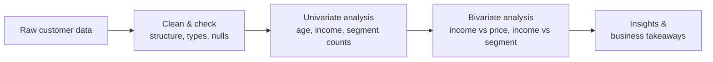
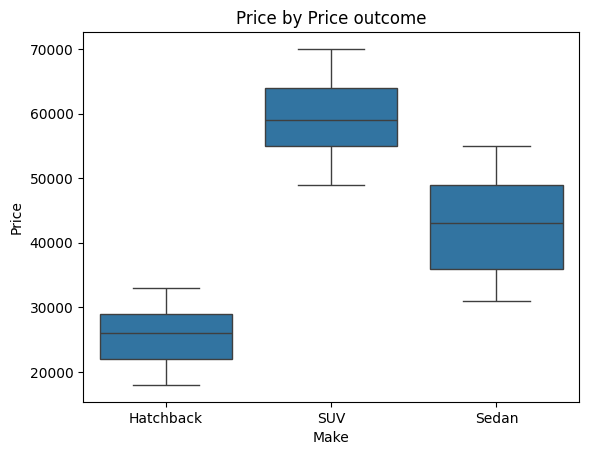
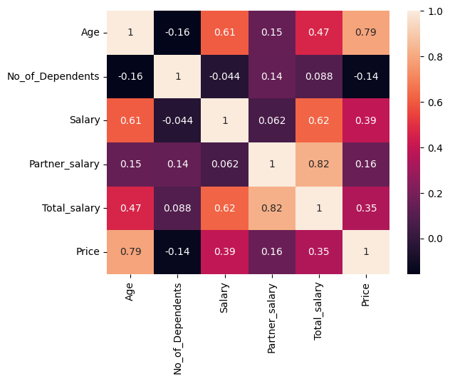

# Austo Automobiles - Exploratory Data Analysis

Austo Motor Company is looking to expand from the UK into the US market and wanted to understand its existing car buyers first: who they are, how much they earn, and what that tells us about what they buy. This project digs into their customer data to find patterns that could shape that expansion strategy.

## Dataset

1,581 customer records, 14 columns, no missing values.

- Customer info: Age, Gender, Profession, Marital_status, Education, No_of_Dependents, Personal_loan, House_loan, Partner_working
- Income: Salary, Partner_salary, Total_salary
- Purchase: Price, Make (Hatchback, Sedan, SUV)

## What I did

1. Checked the data for structure, types, and missing values
2. Looked at each variable on its own (age, income, segment counts)
3. Looked at how variables relate to each other (income vs price, income vs segment)
4. Pulled out the patterns that actually matter for the business question

## What I found

| Segment | Count | Avg. price | Avg. household income |
|---|---:|---:|---:|
| Hatchback | 884 | 25,561 | 72,676 |
| Sedan | 460 | 42,672 | 82,241 |
| SUV | 237 | 59,304 | 99,316 |

Hatchbacks are by far the most common purchase, but SUV buyers have the highest household income by a wide margin.

The heatmap turned up the biggest surprise in this analysis: age correlates with price at r = 0.79, much stronger than salary (r = 0.39) or household income (r = 0.35). Age is the strongest single predictor of what someone spends, more than how much they earn.

## Takeaway

Age, not income, is the strongest signal for what someone will buy. That points to a segmentation strategy built around life stage first (younger buyers toward hatchbacks, older/established buyers toward SUVs and sedans), with income as a secondary factor for pricing and financing offers.

## Tools

Python, pandas, matplotlib/seaborn - Jupyter notebook, exported to HTML.

## How to view it

Download `EDA_Naresh_Peta_Austo_automobile.html` and open it in any browser to see the full notebook with code, charts, and output.
